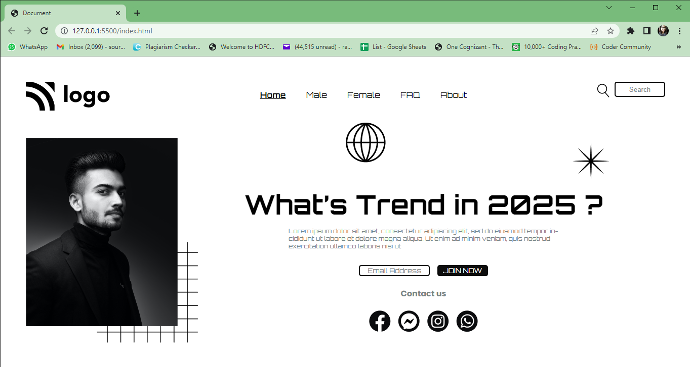

# Street Style Landing Page 

This is my very first project. It is a very stylish web-page. Kindly note that I haven't make it responsive so the content may appear a bit misplaced in your device.

### Name: SOURITA RAY

## Demo
***

## What have I learnt in this project?
***
In this project I have learned about 
- CSS Positions mainly  about absolute position and relative position. 
- CSS Selectors basics mainly about direct child selector.

## Time required to complete the project
***
More than 12 hours since this is the very first project I have done on HTML and CSS.

## Contact me on:
***
- [Linked In-Sourita Ray](www.linkedin.com/in/sourita-ray-89bab0212)
- [Email-id Sourita Ray](souritaray@gmail.com)

## Feedback
***
You can provide your feedback at souritaray@gmail.com

